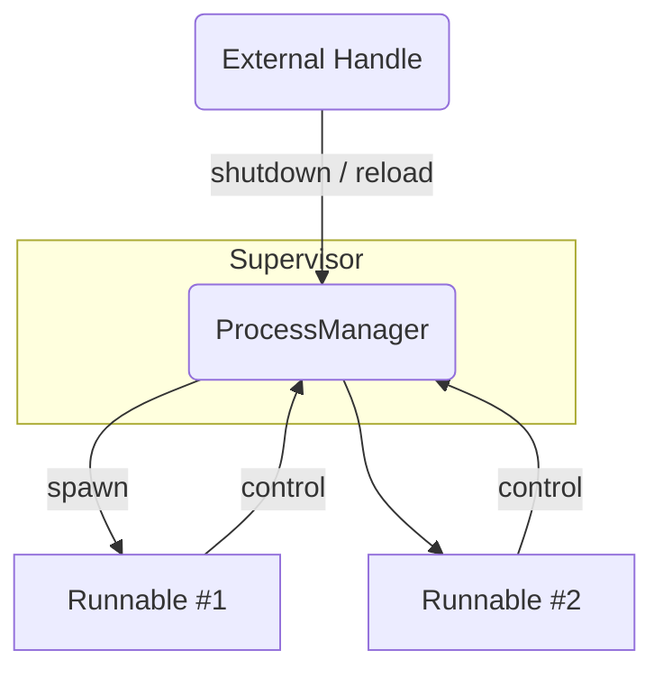

# ProcessManager

`ProcessManager` is a light-weight **Tokio based supervisor** for coordinating
multiple long-running asynchronous tasks (called *processes*).
It takes care of

* spawning all registered processes,
* forwarding *reload* / *shutdown* commands,
* propagating errors,
* initiating a **graceful shutdown** of the whole tree once any process fails,
* and optionally cleaning up completed children to avoid memory leaks.

The crate is completely runtime-agnostic except for its dependency on Tokio
tasks behind the scenes; you are free to use any async code in your own
processes.

---

## Table of Contents

1. [Features](#features)
2. [Installation](#installation)
3. [Quick-Start](#quick-start)
4. [Built-in Helpers](#built-in-helpers)
5. [Examples](#examples)
6. [High-Level Architecture](#high-level-architecture)
7. [Crate Features](#crate-features)
8. [License](#license)

---

## Features

| Capability                        | Description                                                               |
| -------------------------------- | ------------------------------------------------------------------------- |
| Graceful shutdown                | Propagates a single `shutdown` request to **all** children.               |
| Dynamic child management         | Add new `Runnable`s even while the manager is already running.            |
| Error propagation                | A failing child triggers a global shutdown and returns the *first* error. |
| Auto cleanup                     | Optionally remove finished children to keep memory usage bounded.         |
| Hierarchical composition         | Managers implement `Runnable` themselves → build arbitrary process trees. |
| Built-in helpers                 | See [`IdleProcess`](#built-in-helpers) and [`SignalReceiver`](#built-in-helpers). |

---

## Installation

Add the dependency to your `Cargo.toml`:

```toml
[dependencies]
processmanager = "0"
```

Optional features are listed [below](#crate-features).

---

## Quick-Start

A minimal program that runs two workers for three seconds and then shuts down
gracefully:

```rust
use processmanager::*;
use std::{sync::Arc, time::Duration};
use tokio::time::{interval, sleep};

struct Worker {
    id: usize,
    guard: Arc<RuntimeGuard>,
}

impl Worker {
    fn new(id: usize) -> Self {
        Self { id, guard: Arc::new(RuntimeGuard::default()) }
    }
}

impl Runnable for Worker {
    fn process_start(&self) -> ProcFuture<'_> {
        let id = self.id;
        let guard = self.guard.clone();

        Box::pin(async move {
            let ticker = guard.runtime_ticker().await;
            let mut beat = interval(Duration::from_secs(1));

            loop {
                match ticker.tick(beat.tick()).await {
                    ProcessOperation::Next(_) => println!("worker-{id}: heartbeat"),
                    ProcessOperation::Control(RuntimeControlMessage::Shutdown) => break,
                    _ => continue,
                }
            }
            Ok(())
        })
    }

    fn process_handle(&self) -> Arc<dyn ProcessControlHandler> {
        self.guard.handle()
    }
}

#[tokio::main]
async fn main() {
    let manager = ProcessManagerBuilder::default()
        .pre_insert(Worker::new(0))
        .pre_insert(Worker::new(1))
        .build();

    let handle = manager.process_handle();

    tokio::spawn(async move {
        manager.process_start().await.expect("manager error");
    });

    sleep(Duration::from_secs(3)).await;
    handle.shutdown().await;
}
```

---

## Built-in Helpers

| Helper           | Purpose                                                                                                                  | Feature flag |
| ---------------- | ------------------------------------------------------------------------------------------------------------------------ | ------------ |
| `IdleProcess`    | Keeps an otherwise empty manager alive until an external shutdown is requested.                                          | —            |
| `SignalReceiver` | Listens for `SIGHUP`, `SIGINT`, `SIGTERM`, `SIGQUIT` and converts them into *shutdown / reload* control messages.        | `signal`     |

Enable `SignalReceiver` like this:

```toml
processmanager = { version = "0", features = ["signal"] }
```

---

## Examples

Ready-to-run examples live in [`examples/`](examples/) and can be launched with
Cargo:

| Command                                      | Highlights                                             |
| -------------------------------------------- | ------------------------------------------------------ |
| `cargo run --example simple`                 | Minimal setup, two workers, graceful shutdown          |
| `cargo run --example dynamic_add`            | Dynamically add workers while the manager is running   |

Feel free to copy or adapt the code for your own services.

---

## High-Level Architecture



* Every `Runnable` gets its own Tokio task.
* A `ProcessControlHandler` allows external code to **shut down** or **reload**
  a single process or the whole subtree.
* The first child that ends in `Err(_)` terminates the entire supervisor.

---

## Crate Features

| Feature   | Default? | Description                                                         |
| --------- | -------- | ------------------------------------------------------------------- |
| `signal`  | no       | Activates `builtin::SignalReceiver` for Unix signal handling.        |
| `tracing` | no       | Emit structured log events via the `tracing` crate.                 |
| `log`     | no       | Use the `log` crate for textual logging if `tracing` is disabled.   |

Pick one of `tracing` **or** `log` to avoid duplicate output.

---

## License

Licensed under either of

* Apache License, Version 2.0
* MIT license

at your option.
