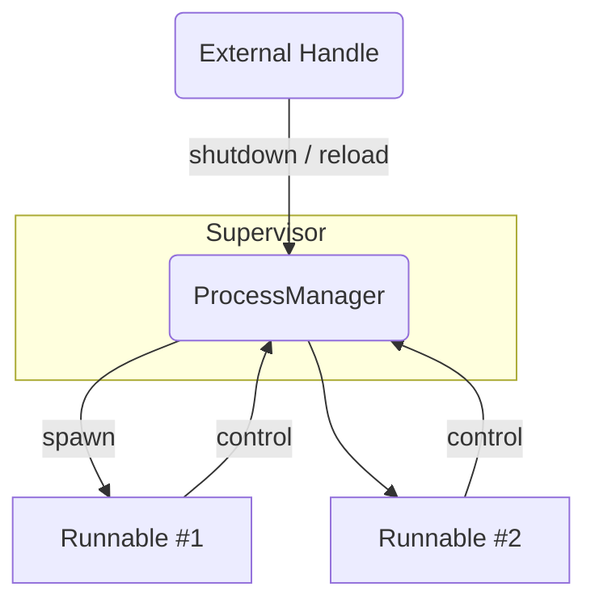

# ProcessManager

Manage multiple running services. A ProcessManager collects impl of `Runnable`
and takes over the runtime management like starting, stopping (graceful or in
failure) of services.

If one service fails, the manager initiates  a graceful shutdown for all other.

# Examples

```rust
use processmanager::*;
use std::sync::Arc;

#[tokio::main]
async fn main() {

    #[derive(Default)]
    struct ExampleController {
        runtime_guard: RuntimeGuard,
    }

    impl Runnable for ExampleController {
        fn process_start(&self) -> ProcFuture<'_> {
            Box::pin(async {
                // Emit a heartbeat every second
                let mut interval = tokio::time::interval(tokio::time::Duration::from_secs(1));
                // Create a ticker that also listens for shutdown / reload signals
                let ticker = self.runtime_guard.runtime_ticker().await;

                loop {
                    match ticker.tick(interval.tick()).await {
                        ProcessOperation::Next(_) => println!("work"),
                        ProcessOperation::Control(RuntimeControlMessage::Shutdown) => {
                            println!("shutdown");
                            break;
                        },
                        ProcessOperation::Control(RuntimeControlMessage::Reload) => {
                            println!("trigger reload");
                        },
                        // ignore any future control messages we don't care about
                        ProcessOperation::Control(_) => continue,
                    }
                }

                Ok(())
            })
        }

        fn process_handle(&self) -> Arc<dyn ProcessControlHandler> {
            self.runtime_guard.handle()
        }
    }

    let mut manager = ProcessManager::new();
    manager.insert(ExampleController::default());

    let handle = manager.process_handle();

    // start all processes
    let _ = tokio::spawn(async move {
        manager.process_start().await.expect("service start failed");
    });

    // Shutdown waits for all services to shutdown gracefully.
    handle.shutdown().await;
}

```
# Architecture (high-level)


